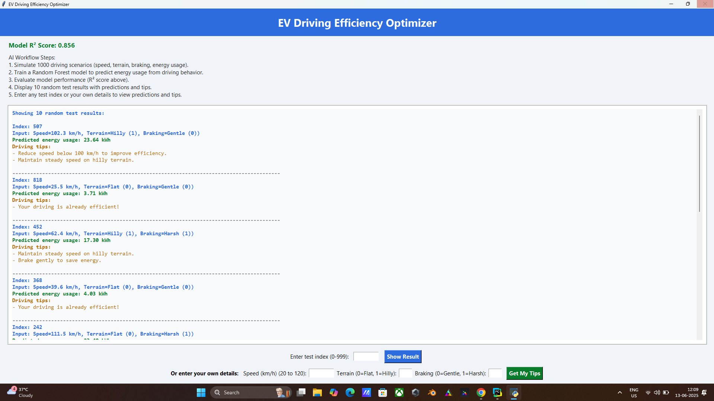

# ⚡ EV Driving Efficiency Optimizer

This project is a machine learning-powered desktop application that helps electric vehicle (EV) drivers improve their energy efficiency based on driving behavior. It simulates driving data, trains a Random Forest model, and provides personalized driving tips through an interactive GUI built with Tkinter.

## 🚀 Features

- Simulates 1000 driving scenarios with random speed, terrain, and braking patterns
- Predicts energy usage using a trained Random Forest Regressor
- Provides actionable driving tips to improve efficiency
- Interactive GUI to:
  - Explore 10 random test samples
  - Enter a custom driving scenario and get predictions + suggestions

## 🛠️ Tech Stack

- **Python**
- **scikit-learn** – for ML model training
- **Pandas & NumPy** – for data generation and handling
- **Tkinter** – for GUI

## 📷 Screenshot



## 💡 How It Works

1. Simulate a dataset with variables:
   - Speed (20-120 km/h)
   - Terrain (0 = Flat, 1 = Hilly)
   - Braking (0 = Gentle, 1 = Harsh)
   - Energy usage based on these factors
2. Train a Random Forest model to predict energy usage
3. Show model accuracy (R² Score)
4. Let users test with sample data or input their own
5. Offer real-time efficiency tips

## 🧩 How to Run

1. Clone the repo:
   ```bash
   git clone https://github.com/ayushsingh-01/AI-Powered-Driving-Efficiency-Optimizer.git
   cd ev-efficiency-optimizer
